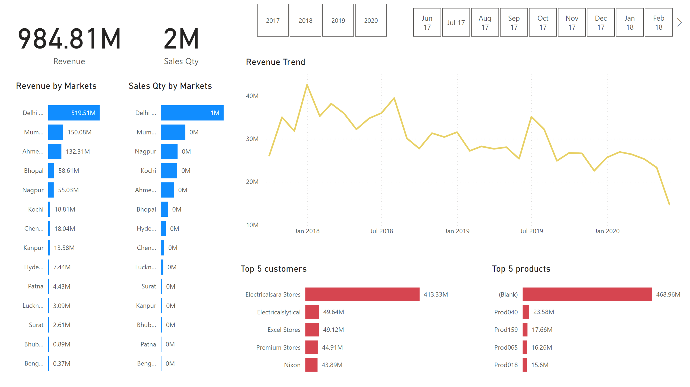

# PowerBi_Sales_Analysis



## Overview

This project provides a comprehensive experience in data analysis, specifically focused on generating sales insights for a computer hardware manufacturer, ALGO Hardware. 

## Project Breakdown

The project consists of several parts:

1. **Problem Statement**: Understanding the challenges faced by ALGO Hardware's sales director regarding sales tracking and data insights.
2. **Data Discovery**: Utilizing the AIMS Grid project management tool to plan the project, identify stakeholders, and define success criteria.
3. **Data Analysis Using SQL**: Running SQL queries to extract insights from the MySQL database.
4. **Data Cleaning and Merging**: Preparing data for analysis by cleaning and merging datasets.
5. **Dashboard Creation**: Building a Power BI dashboard to visualize sales trends and key metrics.

## Project Goals

- Generate a Power BI dashboard that provides real-time insights into sales performance.
- Reduce the time and cost associated with manual data processing and reporting.
- Enable data-driven decision-making for sales strategies.

## Tools and Technologies

- **Power BI**: For data visualization and dashboard creation.
- **MySQL**: For data storage and querying.
- **[AIMS Grid](https://medium.com/@lakshmiprabharamesh1993/aims-grid-a-bulls-eye-project-management-tool-for-data-analysts-team-leaders-and-directors-2cc47a122c9c)**: For project management.

## Getting Started

### Prerequisites

1. **Install MySQL**: Follow the [installation guide](https://dev.mysql.com/doc/refman/8.0/en/installing.html) to set up MySQL on your local machine.
2. **Power BI**: Download and install Power BI Desktop from the [official website](https://powerbi.microsoft.com/en-us/downloads/).

### Database Setup

1. Download the SQL dump file from the provided GitHub repository.
2. Import the SQL dump into your MySQL server using MySQL Workbench.

### Running SQL Queries
Sample queries include:

```sql
-- Show all customer records
SELECT * FROM customers;

-- Show total number of customers
SELECT count(*) FROM customers;

-- Show transactions for Chennai market (market code for Chennai is Mark001)
SELECT * FROM transactions WHERE market_code='Mark001';

-- Show distinct product codes that were sold in Chennai
SELECT DISTINCT product_code FROM transactions WHERE market_code='Mark001';

-- Show transactions where currency is US dollars
SELECT * FROM transactions WHERE currency="USD";

-- Show transactions in 2020 joined by date table
SELECT transactions.*, date.* 
FROM transactions 
INNER JOIN date ON transactions.order_date=date.date 
WHERE date.year=2020;

-- Show total revenue in year 2020
SELECT SUM(transactions.sales_amount) 
FROM transactions 
INNER JOIN date ON transactions.order_date=date.date 
WHERE date.year=2020 AND (transactions.currency="INR" OR transactions.currency="USD");

-- Show total revenue in year 2020, January Month
SELECT SUM(transactions.sales_amount) 
FROM transactions 
INNER JOIN date ON transactions.order_date=date.date 
WHERE date.year=2020 AND date.month_name="January" 
AND (transactions.currency="INR" OR transactions.currency="USD");

-- Show total revenue in year 2020 in Chennai
SELECT SUM(transactions.sales_amount) 
FROM transactions 
INNER JOIN date ON transactions.order_date=date.date 
WHERE date.year=2020 AND transactions.market_code="Mark001";
